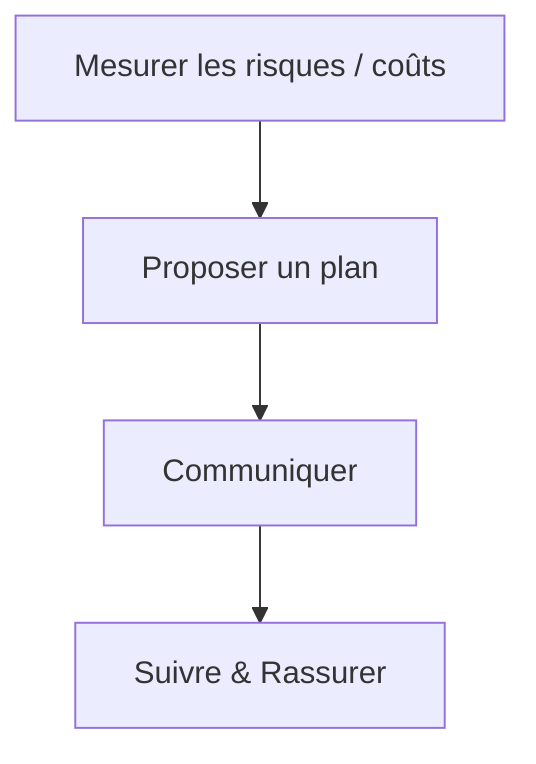

---
# You can also start simply with 'default'
theme: seriph
titleTemplate: '%s - Valentin Dumas'
fonts:
  sans: DM Sans
  serif: Noto Serif
  mono: Consolas
addons:
  - slidev-addon-graph
background: https://images.unsplash.com/photo-1716406536069-c27068316336?q=80&w=2081&auto=format&fit=crop&ixlib=rb-4.1.0&ixid=M3wxMjA3fDB8MHxwaG90by1wYWdlfHx8fGVufDB8fHx8fA%3D%3D
# some information about your slides (markdown enabled)
title: "Le dilemme du Code Legacy: on maintient ou on réécrit ?"
info: |
  ## Slidev Starter Template
  Presentation slides for developers.
class: text-center
drawings:
  persist: false
transition: fade
mdc: true
---

# Le dilemme du code legacy

## Maintenir ou Réécrire ?

<div class="abs-br m-6 text-xl">
  <span class="text-xs m-x-3 text-white/60">Valentin Dumas</span>
  <a href="https://github.com/ValentinDumas/talks" target="_blank" class="slidev-icon-btn">
    <carbon:logo-github />
  </a>
  <a href="https://www.linkedin.com/in/valentindumas" target="_blank" class="slidev-icon-btn">
    <carbon:logo-linkedin />
  </a>
</div>

<!--
The last comment block of each slide will be treated as slide notes. It will be visible and editable in Presenter Mode along with the slide. [Read more in the docs](https://sli.dev/guide/syntax.html#notes)
-->

---
name: Ariane5 case study
layout: center
class: opacity-80
---

<div class="size-full flex items-center justify-center">
  
</div>


<!-- 

En Guyane française, le 4 juin 1996. Le ciel est dégagé, l'excitation est palpable : Ariane 5 s'apprête à effectuer son vol inaugural.
Mais 37 secondes après le décollage, l'impensable se produit : la fusée dévie de sa trajectoire, se disloque et explose en plein vol.
À l'origine de ce désastre ? Une simple erreur logicielle: un problème de saturation d'entier non gérée lors de la conversion d'une valeur de 64 bits en 16 bits.
Ensuite ? Ce dépassement a entraîné l'arrêt du système de guidage inertiel principal, puis de son système de secours identique. Privée de toute information de navigation, la fusée a interprété des données erronées comme des commandes valides, déclenchant une manœuvre fatale. Wikipedia+5Wikipedia+5www-users.cse.umn.edu+5
En cause ? Un morceau de code hérité d'Ariane 4, censé être inoffensif…
Bilan ? Un échec retentissant, une perte de centaines de millions de dollars, et quatre satellites scientifiques détruits. thisdayinaviation.com+7Sunny Day+7SmartBear Software+7SmartBear Software+7Wikipedia+7Wikipedia+7
Ce qui aurait pu être évité ?

-->

---
name: Ariane5 case study possible improvements
transition: slide-left
layout: image-right
image: /ariane5_501_launch_2k.jpg
class: opacity-80
---

# Un bug coûteux

Ce qui aurait pu fonctionner ?

<div class="text-xl opacity-80 p-2">

  <span v-click>📝 Tests complets du SRI</span>
  <br><br>

  <span v-click>🧑‍💻 <i>" ça fonctionne sur l'ancien "</i></span>
  <br><br>

  <span v-click>🤹 Version 4 != Version 5</span>
  <br><br>

  <span v-click>🛠 Gestion d'exceptions, programmation défensive</span>
  <!-- note: peut suggérer un manque de tests -->
  <!-- note: sur des données sensibles comme ça, on peut emettre des réserves sur les requetes de récupération -->

</div>

<style>
strong, h1 {
  color: #2B90B6;
}
</style>

<!--
C’est un exemple viscéral qui démontre pourquoi les systèmes legacy nécessitent une attention stratégique,
car parfois,
une simple ligne de code peut faire la différence entre le succès et la catastrophe.
-->

---
transition: slide-up
layout: statement
class: text-4xl opacity-80
---

❝ Legacy code is simply code **without tests** ❞

<span class="text-base text-gray-500">— Michael Feathers</span>

<!-- ... -->

<style>
strong {
  color: #2B90B6;
}
</style>

---
transition: slide-up
layout: statement
class: text-4xl opacity-80
---

❝ Legacy code is **valuable** code
<br>
<br>

you're **afraid** to change ❞

<span class="text-base text-gray-500">— Nicolas Carlo & Alex Bolboaca</span>

<!-- ... -->

<style>
strong {
  color: #2B90B6;
}
</style>

---
name: Présentation
layout: statement
class: opacity-80
---

<div class="flex flex-col justify-center items-center gap-3">
  
  <div class="pl-4 text-xl"><strong>Valentin DUMAS</strong></div>
  <div class="pl-4 text-sm">Ingénieur logiciel</div>
  
</div>

---
transition: slide-left
layout: default
---

<!-- TODO: probablement remplacer par un exemple de ton exercice de use case -->
```java [Extrait du Gilded Rose refactoring Kata] {*}{lines:true, maxHeight:'63vh'}
public void updateQuality() {
        for (int i = 0; i < items.length; i++) {
            if (!items[i].name.equals("Aged Brie")
                    && !items[i].name.equals("Backstage passes to a TAFKAL80ETC concert")) {
                if (items[i].quality > 0) {
                    if (!items[i].name.equals("Sulfuras, Hand of Ragnaros")) {
                        items[i].quality = items[i].quality - 1;
                    }
                }
            } else {
                if (items[i].quality < 50) {
                    items[i].quality = items[i].quality + 1;

                    if (items[i].name.equals("Backstage passes to a TAFKAL80ETC concert")) {
                        if (items[i].sellIn < 11) {
                            if (items[i].quality < 50) {
                                items[i].quality = items[i].quality + 1;
                            }
                        }

                        if (items[i].sellIn < 6) {
                            if (items[i].quality < 50) {
                                items[i].quality = items[i].quality + 1;
                            }
                        }
                    }
                }
            }

            if (!items[i].name.equals("Sulfuras, Hand of Ragnaros")) {
                items[i].sellIn = items[i].sellIn - 1;
            }

            if (items[i].sellIn < 0) {
                if (!items[i].name.equals("Aged Brie")) {
                    if (!items[i].name.equals("Backstage passes to a TAFKAL80ETC concert")) {
                        if (items[i].quality > 0) {
                            if (!items[i].name.equals("Sulfuras, Hand of Ragnaros")) {
                                items[i].quality = items[i].quality - 1;
                            }
                        }
                    } else {
                        items[i].quality = items[i].quality - items[i].quality;
                    }
                } else {
                    if (items[i].quality < 50) {
                        items[i].quality = items[i].quality + 1;
                    }
                }
            }
        }
    }
```

<!--
  Imagine un matin, tu arrives au bureau et quand tu ouvres ton IDE la première chose que tu vois c’est ça:

  **Montrer code** Vous arrivez à lire ce code ?.. Vous êtes forts.
  ** Expliquer code rapidement, ses défauts, ce qui peut être amélioré**
  ** montrer le code simplifié**

  Plusieurs challenges, dont un code domaine/métier qui peut s’avérer:
  complexe
  peu lisible

  On peut aussi parler de code enchevêtré, spaghetti, BBofMud, …

  **Montrer le plat de pâtes**
  Quand vous codez un soft, vous voyez le plat de pâtes.
  Vos relecteurs, et même vous-même après quelques mois sans relire le code = ce que vous voyez est magique.
  complexité visuelle → peu lisible

  A cette complexité s’ajoute ceci.
-->

---
name: Enjeux et Challenges du code legacy
transition: slide-left
layout: two-cols
---

# Un peu de legacy
Enjeux et challenges

<div class="flex flex-col gap-6 p-10 justify-center">
  <!-- Ligne 1 -->
  <div class="flex gap-8 items-center">
    
    
    
  </div>
  <!-- Ligne 2 -->
  <div v-click="4" class="flex gap-8 items-center">
    
    <span v-mark="4" class="text-xl">&gt; 100k lignes</span>
  </div>
  <!-- Ligne 3 -->
  <div v-click="5" class="flex gap-8 items-center">
    
    
  </div>
</div>

::right::

<div v-click="6" class="w-full h-full flex justify-center items-center">

</div>

---
name: Enjeux et Challenges du code legacy pt. 2
transition: slide-left
layout: two-cols
class: opacity-80
---

# Un peu de legacy
Enjeux et challenges

<div class="flex flex-col gap-6 justify-center">
  
</div>

::right::

<div class="w-full h-full flex flex-col justify-center items-center py-25">
  <!-- Ligne 1 -->
  <div class="flex gap-8 items-center">
    
    
  </div>
  <!-- Ligne 2 -->
  <div v-click class="flex gap-8 items-center">
    
  </div>
</div>

<!-- notes
  Question: comment on en est arrivés là ?
 -->


---
transition: slide-up
layout: statement
class: text-4xl
---

❝ Tout code **deviendra legacy** ❞

<style>
strong {
  color: #2B90B6;
}
</style>

<!--

“Avoir un code Legacy n'est pas un échec, ça prouve que l'application a eu du succès dans le temps, malgré la dette technique. De toute façon n'importe quel code, aussi beau soit-il écrit aujourd'hui sera le Legacy de demain. Il est quand même important de revenir régulièrement pour rafraîchir le code et enlever progressivement de la dette technique.” explique Gabriel Pillet, CTO chez Web^ID.

Effectivement, il y a 3 types de code legacy :
- Le code qui a été soigné par ses prédécesseurs. Il est clair, commenté, testé et donc facilement maintenable (mais cela n’est pas le cas le plus fréquent !).
- Le code difficilement maintenable. Il n’est pas très lisible au premier coup d’œil, il contient du code mort ou dupliqué, il y a des classes trop grandes, il y a peu, voire pas de tests unitaires, etc.
- Le code obsolète. C’est un code qui n’a pas suivi les évolutions de framework et/ou de langage. Avec les changements de versions, il est devenu difficile d’ajouter une feature et les développeurs passent leur temps à maintenir le code à flot.

-->

---
name: Symptômes d'un code legacy
transition: slide-left
layout: two-cols
class: h-10 opacity-80
---

# Symptômes d’un code legacy

> Comprendre les sources des problèmes

<!-- 

Évolution du modèle (économique, processus, règles)
  ex: Changements réglementaires
>> users que prévu, donc “Mon app ne tient pas la charge”
Perte de maîtrise (connaissance / 1 personne, 0 tests, ..)
Maintenance coûteuse (dette)

 
-->

<div v-click="1" class="flex flex-col justify-center h-full pt-42">
  <h3 class="text-xl font-bold mb-4">🔧 Facteurs internes</h3>
  <ul v-click="2"class="list-disc list-inside space-y-2 text-left">
    <li>Vélocité basse <!-- ou ne fait que baisser / + de temps pour amener des new features --></li>
    <li>Bugs et regressions <!-- (fonctionnelles) --></li>
    <li>Connaissance / 1 personne <!-- (!! si ils partent compliqué entreprise de subsister) --></li>
    <li>Couplage fort entre modules</li>
    <li>Absence ou faible couverture de tests</li>
    <li>Manque de documentation</li>
  </ul>
</div>

::right::

<div v-click=3 class="flex flex-col pt-40">
  <h3 class="text-xl font-bold mb-4">🧭 Facteurs externes</h3>
  <ul v-click="4" class="list-disc list-inside space-y-2 text-left">
    <li>Évolution du modèle </li>
    <li>Changements réglementaires</li>
    <li>Turn-over</li>
    <li class="opacity-50">>> users que prévu</li>
    <li class="opacity-50">Pression business pour livrer vite</li>
    <li class="opacity-50">Empilement de demandes clients</li>
    </ul>
</div>

<!-- Code legacy = coûts + risques -->

---
transition: slide-left
layout: default
class: text-2xl opacity-80
---

# Problèmes pour les devs

<div class="text-xl p-2">

  😤 Rechignement <!-- (olala ça touche à la partie de codebase que j’aime pas). -->
  <br><br>

  ⚡ Tensions <!-- = shipper à la boure (incompréhensions entre les équipes produits et dev. -->
  <br><br>

  😞 Résignation <!-- de tte facon tout le monde s’en fout, la codebase est pourrie, donc je continue à shipper du code pourri. et si ça me saoule un jour je m’en vais. -->
  <br><br>

</div>

---
transition: slide-left
layout: default
class: text-2xl opacity-80
---

# Problèmes pour les entreprises

<div class="text-xl p-2">

  🏃‍♂️ Perte de compétitivité  
  <br><br>
  🚌 “Bus factor”
  <br><br>

</div>

<!--
  Perte compétitivité: Code legacy != que un pb pour les dev, c(‘est un pb  pour l’entreprise !! (ex: si les concurrents sont plus stables, …)

  "Bus Factor": le guru s(en va de l’entreprise (risque stratégique) = plus personne peut maintenir le code existant. Comment faire ???
-->

---
name: Remediation possibles
transition: slide-left
class: opacity-80
---

# 🚨 Situations fréquentes vs 💡 Solutions

<div class="pt-10">
<table class="w-full text-sm border-collapse">
  <thead>
    <tr class="border-b">
      <th class="text-left p-2">🧩 <strong>Situation</strong></th>
      <th class="text-left p-2">🛠️ <strong>Solution</strong></th>
    </tr>
  </thead>
  <tbody>
    <tr v-click="1" class="border-b align-top">
      <td class="p-2">
        <strong>Pas le temps / pas le budget</strong><br>
        <span class="text-gray-500 italic">Perte de maîtrise: risques vs coûts<br>Incompréhension du code</span>
      </td>
      <td class="p-2">
        👉 Présenter les <strong>risques concrets</strong> et les <strong>coûts potentiels</strong>
      </td>
    </tr>
    <tr v-click="2" class="border-b align-top">
      <td class="p-2">
        <strong>Refonte en sous-marin</strong><br>
        <span class="text-gray-500 italic">Estimation faussée volontairement<br>Confiance rompue entre devs et produit.</span>
      </td>
      <td class="p-2">
        🤝 Recréer la <strong>confiance</strong> entre les équipes.
      </td>
    </tr>
    <tr v-click="3" class="align-top">
      <td class="p-2">
        <strong>Refonte sans fin</strong><br>
        <span class="text-gray-500 italic">Deux codebases à maintenir. La nouvelle devient aussi legacy.<br>Aucun plan clair.</span>
      </td>
      <td class="p-2">
        🧭 Besoin de <strong>planification</strong> claire<br>
        📚 <strong>Former</strong> au refacto
      </td>
    </tr>
  </tbody>
</table>
</div>

<!--
  Pas le temps / budget:
    - Souvent lié à une peur de toucher une zone mal comprise du code.
    - La personne n’a pas la maîtrise des risques / coûts réels
  Refonte sous-marin
    -pb de confiance (ex de surestimation de ticket)
    - 🧩 *TODO: Activités d’alignement, ateliers à définir* |
  Refonte sans fin
    - ex: daily.
-->

---
name: Etude de cas banque en ligne qui veut s'etendre à linternational
transition: slide-left
class: opacity-80
---

# Etude de cas

<div class="pt-20 flex flex-col justify-center w-150">
  <Card>
  
  <span v-click>🌎 Banque en ligne française qui veut s'ouvrir à l'international</span>
  <br>

  <span v-click>👛 Besoin: gestion multidevises</span>
  <br>

  <span v-click>🔧 Code <!-- devenu --> complexe et fragile</span>
  <br>
  
  <span v-click>💥 Compréhension difficile</span> <!-- Equipes ont peur de "casser" le "code" ! -->

  </Card>
</div>

<!-- Comment faire ? -->

---
transition: slide-left
layout: two-cols
class: opacity-80
---

# **Mesurer** les risques et les coûts

<!-- TODO: Lire pour la def de la dette; https://www.bitegarden.com/how-to-evaluate-technical-debt-sonarqube -->

<div class="space-y-4">
  <div v-click="1">🧼 <strong>Qualité</strong> de code <span class="opacity-60 text-sm"> (dette, code smells, WTF par minute)</span></div>
  <div v-click="3">🐛 Nombre de <strong>régressions</strong> fonctionnelles</div>
  <div v-click="4">⏱️ Temps <strong>estimé</strong> vs Temps <strong>réel</strong></div>
  <div v-click="5">💸 <strong>Coût réel</strong> par feature</div>
</div>

<!-- 
  Qualité de code: Sonar, ... Par où commencer ?
  Nombre de régressions fonctionnelles: 
  Compter le temps réel passé à faire des correctifs
    => cout réel: "comparer annoncé au po VS pris en vrai pour shipper la feature + corriger pb amenés"
-->

::right::

<div v-click="2" class="flex flex-col justify-center items-center w-full h-full pl-12">
  
</div>

<!-- 
Comparer “annoncé au PO” VS “temps réel pris pour shipper la feature + corriger les pb/bugs que ça a amené.”
Une fois qu’on a fait ça, on peut réfléchir à un plan

Note: y'a pas de recette magique qui fonctionne à 100% à chaque fois ! car on fait beaucoup d'humain, et l'humain est faillible: nous avons nos qualités / défaut -> et c'est ça qui rend notre métier passionnant !  
-->

---
transition: slide-left
class: opacity-80
---

# **Proposer** un plan

<h3 v-click>🎯 Périmètre d'intervention</h3>
<br>
<div class="space-y- pl-4">
  <div v-click>🗺️ Définir un périmètre d'<strong>intervention initial</strong></div>
</div>

<br>
  
  <!--
  là ou ça a le plus d'impact ? 
  (on ne refacto pas toute une codebase comme ça d’un coup., mais partie par partie, progressivement. (Exemple: On focus sur la “prise de commande)
  -->

<h3 v-click>🎯 Actions</h3>
<br>
<div class="space-y- pl-4 flex flex-col gap-4">
  <div v-click>🛡️ Pratiques de développement</div>
  <div v-click>🔍 Expliciter les concepts métier</div>
  <span v-click class="text-sm text-gray-500 pl-8">Ex : une colonne "montant" → en fait un montant en euros : migration, renommage, typage</span>
  <div v-click>🚫 Eviter le "code freeze" !</div> <!-- on continue d'intégrer ! -->
  <span v-click class="text-sm text-gray-500 pl-8">Ne pas isoler la refonte sur une branche morte.  
  Indicateur : mesure de la part de "nouveau" code réellement exécuté</span>
</div>

<!-- TODO: put items correctly
### Actions
- Prévenir les anomalies /bugs: utiliser des Value Objects (DDD). PK ?!
- Explicitation (devises/???utiliser exemple) == migration de BDD. (ex: ce montant est un montant en euros)
- Pas de code freeze !: pas partir sur une branche à part et partir du principe que tout s’arrête à côté. Comment ? Indicateur: mesurer la proportion entre le vieux code et le nouveau code qui s’execute.

**COMPARER le coût: refonte VS statut quo**

Tout ça ? => Calculer le cop^put de la refonte (estimation gros grain à ce stade)(en nombre de jour à investir
	Comparer coût refonte VS statut quo(=si on change rien)

Une fois qu’on a ces deux coûts ? 

A quoi nous revient la refonte (commencer à estimer le nb de jours à investir vs si on change rien)
 -->

---
transition: slide-left
class: opacity-80
---

# 🤝 **Communiquer** avec les parties prenantes

> Se synchroniser et avancer collectivement

<br>

<div class="space-y-4">
  <div v-click>📣 Informer</div>
  <!-- <span class="text-sm text-gray-500 italic">
  Les personnes impactées par notre refonte des coûts et risques actuels (ex: équipe produit, devises)
  </span> -->
  <div v-click>🗺️ Présenter le plan de <strong>refonte</strong></div>
  <!-- <span class="text-sm text-gray-500 italic">
  Montrer en quoi la refonte répond aux problèmes identifiés
  </span> -->
  <div v-click>🤝 <strong>Négocier</strong> la planification</div>
  <!-- <span class="text-sm text-gray-500 italic">
  Avec le PO ou les sponsors : diplomatie et intelligence collective
  </span> -->
  <div v-click>✅ Obtenir l’<strong>accord</strong> de la direction</div>
  <!-- <span class="text-sm text-gray-500 italic">
  Discussion avec les décideurs (CTO, VP Engineering…)
  </span> -->
  <div v-click>🎯 Aligner avec la <strong>stratégie d’entreprise</strong></div>
  <!-- <span class="text-sm text-gray-500 italic">
  Montrer l'alignement entre la refonte et les objectifs globaux
  </span> -->
</div>

<!--
  parties prenantes <=> collègues
  notes...
-->

---
transition: slide-left
class: opacity-80
--- 

# 👁️‍🗨️ **Suivre** et donner de la **visibilité**

  <br>

  <span v-click>🚧 Éviter l’**effet tunnel**</span> <!-- <span class="text-sm text-gray-500">Comment ? PoC, baby steps (Mikado), déploiements réguliers</span> -->
  <br>

  <span v-click>⏪ Tout changement est rollback-able rapidement</span> <!-- == sécurité -->
  <br>

  <span v-click> 📢 **Partager l'avancement** → feedback</span> <!-- Permet de négocier : qualité, ajustements, arbitrages justifiés -->
  <br>

<!-- 
Une fois qu’on rentre dans la phase de refonte, il faut faire un suivi, et rassurer les gens avec qui on va travailler.
!! risque que ça pète est gros,
!! commencer par tacler les projets les + ambitieux en 1er 
	!! sur les tous petits périmètres… pour voir si l’approche fonctionne ou pas (PöC

éviter l’effet tunnel: …POC, baby steps + déploiements réguliers (ça spasse pas bien, on connait la cause !,

Vérifier qu’on peut annuler un changement (=rollback) < 1 min (très rapidement, TODO: vérifier le time !)
Mettre en place des indicateurs qui ne peuvent pas régresser: CI, warnings, …
Le but de tout çà ?
Partager l’avancement avec les personnes intéressées
ET négocier des ajustements si nécessaire (ex: coordination des diffferentes taches avec les equipes produits (TODO: prendre un exemple)
!! Etre transparent syr les risques (tenir au courant les personnes impactées) !! 

-->

---
transition: slide-left
layout: center
class: opacity-80
---

<Card>
<!-- {theme: 'neutral', scale: 0.5} -->

</Card>

<!-- TODO: peutêtre surligner par étape pour la lisibilité !! (solution: ressortir ce diagramme à chaque étape) -->

---
transition: slide-up
layout: statement
class: text-4xl
---

❝ Legacy code is about the **cost of change** ❞

<span class="text-base text-gray-500">— Michael Feathers</span>

<!-- ... -->

<style>
strong {
  color: #2B90B6;
}
</style>

---
name: Réécriture ou travailler avec lexistant (Brownfield)
transition: slide-left
layout: image
image: https://images.unsplash.com/photo-1748701821466-0b9f8bf839ac?q=80&w=2051&auto=format&fit=crop&ixlib=rb-4.1.0&ixid=M3wxMjA3fDB8MHxwaG90by1wYWdlfHx8fGVufDB8fHx8fA%3D%3D
class: text-xl flex flex-col justify-center opacity-80
---

# Un peu de réécriture

<Card class="w-134 mt-10">

### **Brownfield** development

🐌 Reprise de l’existant
<br><br>
💸 Surprises dans le legacy
<br><br>
🔐 Stack de l’existant
<br><br>
🔥 Risques d’endettement ++ (bugs, dette, deps.)
<br><br>
🧩Challenge: Intégrer des nouvelles features
</Card>

<style>
h3 {
  color: #2B90B6;
}
</style>

<!-- notes.. -->

---
name: Réécriture from scratch (Greenfield)
transition: slide-left
layout: image
image: https://images.unsplash.com/photo-1506260408121-e353d10b87c7?q=80&w=2128&auto=format&fit=crop&ixlib=rb-4.1.0&ixid=M3wxMjA3fDB8MHxwaG90by1wYWdlfHx8fGVufDB8fHx8fA%3D%3D
class: text-xl flex flex-col justify-center opacity-80
---

# Un peu de réécriture

<Card class="w-134 mt-10">

### **Greenfield** development


⏳Délai initial plus court
<br><br>
💰 Budget prévisible
<br><br>
🧱 Stack technique / architecture: choix libre
<br><br>
🟢 Peu de risques / complexité (0 dette)
<br><br>
🧩 Nécessite décisions: UI, backend, infra, tests…
</Card>

<style>
h3 {
  color: #2B90B6;
}
</style>

<!-- notes.. -->

---
transition: slide-left
layout: image
image: brownfield.png
---

# Prendre une décision

<Card>

  <div v-click>
    <h4>🚀 Réécrire</h4>
    <i class="opacity-60">
      <div>“ Le code existant est un handicap (risques et coûts) ”</div> <!-- maintenance -->
      <div>“ Vous disposez du temps, du budget et de la tolérance au risque nécessaires pour le reconstruire ”</div>
    </i>
    <br>
  </div>

  <div v-click>
    <h4>🏗️ Rearchitect</h4>
    <i class="opacity-60">
      <div>“ L'architecture de votre système limite la croissance ”</div>
      <div>“ Vous avez un couplage modéré à fort entre vos composants projets ”</div>
    </i>
    <br>
  </div>

  <div v-click>
    <h4>🔧 Refactor</h4>
    <i class="opacity-60">
      <div>“ Vous pouvez nettoyer le code de manière incrémentale,</div>
      <div>sans trop impacter les fonctionnalités existantes ”</div>
   </i>
    <br>
  </div>
</Card>

<!-- notes.. -->

---
transition: slide-up
layout: statement
class: text-4xl
---

❝ On choisit de s'orienter vers

un **refactoring progressif** ❞

<style>
strong {
  color: #2B90B6;
}
</style>

<!-- ... -->

---
transition: slide-left
layout: center
---

# Réarchitecturer

Strangling the monolith


<!--
  Rearchitecturer = Modifier la structure du code (parfois en changeant le comportement de l'application)
 -->

---
transition: slide-left
layout: center
---

# Réarchitecturer

Branch-by-abstraction


<!-- notes.. -->

---
transition: slide-left
---

<!-- Slide noire de transition -->

---
name: Notre exemple de refacto le Trivia
transition: slide-left
layout: image-right
image: /trivia-game.jpg
class: opacity-80
---

# Notre exemple
Jeu du Trivia

  <span v-click>🚀 Jeu de questions réponses</span>
  <br>

  <span v-click>🔧 Code <!-- devenu --> complexe et fragile</span>
  <br>
  
  <span v-click>💥 Compréhension difficile</span> <!-- Equipes ont peur de "casser" le "code" ! -->
  <br><br>

<!-- Comment faire ? -->

<style>
strong {
  color: #2B90B6;
}
</style>

---
name: Refactorer code legacy focus on business value
transition: slide-left
layout: image
image: https://images.unsplash.com/photo-1634207284450-f6ad4451b94f?q=80&w=880&auto=format&fit=crop&ixlib=rb-4.1.0&ixid=M3wxMjA3fDB8MHxwaG90by1wYWdlfHx8fGVufDB8fHx8fA%3D%3D
# class: text-xl flex flex-col justify-center
class: opacity-80
---

# Refactorer dans du code legacy

Recette étape par étape

<Card class="card w-134 mt-10 text-xl">

🔦 Identifier les hotspots <!-- seams: fakeDB, seam object, 3rd party server, -->
<br><br>
🔨 Casser les dépendances
<br><br>
🧪 Ecrire les tests <!-- nécessaires (UT, definition: <100ms and 1 feature) -->
<br><br>
🔧 Effectuer un changement
<br><br>
🧩 Refactorer <!-- si besoin -->
</Card>

<style>
h3 {
  color: #2B90B6;
}
p {
  color: #012;
}

.card p {
  color: unset;
}
</style>

<!-- notes.. -->

---
name: Refactoring example Identifier les hotspots
transition: slide-left
class: opacity-80
---

# Identifier les hotspots

> Quand ? vous ne savez pas par où commencer, votre temps est limité

<!-- Besoin: Pas un truc parfait, mais d'un Indicateur qui vous => prendre des décisions plutôt que faire des hypothèses (CodeClimate) -->

<br>
<h3><i>Comment ?</i></h3>
<br>
  1. Calculer la Complexité du Code (fichiers SonarQube) <!-- TODO: regarder  --> <!-- code-complexity (node), base sur num LoC -->
  <br><br>
  2. Calculez le Churn <!-- frequence de modification -->

  ```ts {*}
    git log --format=format: --name-only --since=12.month \
    | egrep -v '^$' \
    | egrep -v '\\.json$' \
    | sort \
    | uniq -c \
    | sort -nr \
    | head -50
  ```

  <!-- nécessaires (UT, definition: <100ms and 1 feature) -->

  <br>
  3. Meilleur ROI = Complexité <span class="opacity-60 text-xs">(Important)</span> * Churn <span class="opacity-60 text-xs">(Urgent)</span>
  <span class="opacity-60 text-xs pl-4">Augmente votre vélocité</span>
  <br>

<!-- 
1.
2.
  git log: récupère des logs
  egrep: retire toutes les lignes vides
  sort: tri alpha
  uniq -c: compte les occurences de chaque nom de fichier
  sort -nr: trie résultats, décroissant
  head -50: garde 50 noms de fichiers les plus changés
3.
 -->

---
name: Refactorer code legacy | Focus on business value
transition: slide-left
#layout: image
#image: https://images.unsplash.com/photo-1576153192396-180ecef2a715?q=80&w=1074&auto=format&fit=crop&ixlib=rb-4.1.0&ixid=M3wxMjA3fDB8MHxwaG90by1wYWdlfHx8fGVufDB8fHx8fA%3D%3D
class: opacity-80
---

# Refactorer dans du code legacy

Focus sur la **valeur** métier

<Card class="flex flex-row w-160">
  
</Card>

<!-- notes.. -->

---
name: Refactoring example Identifier les hotspots
transition: slide-left
class: opacity-80
---

# Identifier les hotspots

> Quand ? vérifier les impacts d'un changement

  <br>
  <h3>Diagramme de dépendance</h3>
  
  

<!-- 
  ...
 -->
 
  <!-- Mikado = graphe de dépendance; libère charge mentale; partage avec pairs -->
  <!-- compléter objectifs par les bords du graph == safe ! => livrer en plusieurs fois -->

---
name: Refactoring example Identifier les hotspots
transition: slide-left
class: opacity-80
---

# Identifier les hotspots

> Quand ? vérifier les impacts d'un changement

  <br>
  <h3>Matrice de dépendance</h3>
  
  

---
name: Refactorer code legacy | Scratch Refactoring et Exploratoire
transition: slide-left
#layout: image
#image: https://images.unsplash.com/photo-1576153192396-180ecef2a715?q=80&w=1074&auto=format&fit=crop&ixlib=rb-4.1.0&ixid=M3wxMjA3fDB8MHxwaG90by1wYWdlfHx8fGVufDB8fHx8fA%3D%3D
---

# Découvrir du code legacy

Scratch Refactoring + Refactoring Exploratoire

> Quand ? Vous essayez de comprendre ce que le code fait vraiment

<br>

> Pratique >> Analyse théorique

<br>

<Card class="flex flex-row w-160">
  
</Card>

<br>

> Permet ? Big Picture

<!--
Refacto Exploratoire

> quand ? avant les refactos structurels (Extract Function)
"Ce qui change en meme temps devrait être gardé à proximité"
!! risqué si pas de tests.
-->

<!--
  Conseils d'uilisation de refacto (auto)
  + attention aux break;continue;return;
  +
    1. Extraire toutes les magic strings et les magic numbers
    2. Extraire des bouts de code dans des fonctions
    3. Inline ces fonctions à nouveau
 -->

---
name: Scratch refacto | Ce qu'on a appris.
transition: slide-left
layout: image-right
image: /trivia-game.jpg
---

# Scratch Refactoring

Ce qu'on a appris

- Deux points d'entrée 'public': add() et roll()

- add(): initialize player data + affichage

- roll(): determine si le joueur est piégé ou non ET le déplace


---
transition: slide-left
layout: statement
class: text-4xl opacity-80
---

# Tester

<style>
h1, h2 {
  color: #2B90B6;
}
</style>

---
name: Refactorer code legacy | Approval tests
transition: slide-left
---

# Approval Tests <!-- Golden, Characterization, Snapshot(React) -->

> Quand ? Mon code n'a aucun tests, je ne sais pas ce qu'il fait.

E2E >= Approval Tests >= Unit Test

https://approvaltests.com/

<div class="flex items-center justify-center gap-20">

  

  <!-- Left: Received -->
  <div v-click="2" class="flex flex-col items-center">
    <div class="text-7xl">📄</div>
    <div class="mt-2 text-xl font-medium text-gray-400">File Received</div>
  </div>

  <!-- Arrow -->
  <div v-click="3" class="text-5xl text-gray-400">➡️</div>

  <!-- Right: Approved -->
  <div v-click="4" v-mark="4" class="flex flex-col items-center">
    <div class="text-7xl">📄</div>
    <div class="mt-2 text-xl font-medium text-green-700">File Approved</div>
  </div>

</div>

<!--
  [Démo] Générer tests chara (créer un test 'add player')
  [Démo][add()] simuler un changement (commenter un console.log)
  Vérifier la nouvelle couverture de test:
    - IntelliJ/Sonar
    - PiTest (mutation testing), [opt] vérifier le N fois execution au niveau de la ligne ;)
  [Démo][add()] Commenter player.push() -> tests vont fail (boucle infinie)
  corriger
  commenter ligne d'en dessous -> fail
  [Démo] Générer test 'add player roll' (avec un roll à 777)

  [Démo][add()][opt] Ajouter un param/méthode/log pour 'tracker' les états des variables privées (ex: places)

-->

---
transition: slide-up
layout: statement
class: text-4xl opacity-80
---

❝ Je dois **tester** avant de refacto,
<br>
<br>

mais mon code est **intestable** ❞

<style>
strong {
  color: #2B90B6;
}
</style>

<!-- ... -->

---
name: Refactorer code legacy | Decoupler Core vs Infra
transition: slide-left
layout: statement
class: text-xl
---

## **Découpler** : Core vs Infrastructure

<style>
  strong {
    color: #2B90B6;
  }
</style>

<!--
Quand ? J'ai un appel db / infra en plein milieu de mon code

  code infra = dépend de système externe, besoin d'un environnement pour s'executer (ex:db, I/O System(logs))
  code core (domaine) = logique pure, depend de rien

  ex: dans notre exemple, console.log et math.random
-->

---
name: Refactorer code legacy | Subclass & Override
transition: slide-left
layout: default
class: 
---

# Subclass & Override

> Quand ? le code existant <i>métier</i> (non testé) a des dépendances, empêchant d'écrire des tests (logs, appels BDD)

<br>

> Solution: extraire le code d'<i>infrastructure</i> (logs, appels BDD) dans des méthodes dédiées.

<br>

````md magic-move {lines: true}
```ts {*|1,9,10}
// Before Subclass & Override
public boolean add(String playerName) {

    players.add(playerName);
    places[howManyPlayers()] = 0;
    purses[howManyPlayers()] = 0;
    inPenaltyBox[howManyPlayers()] = false;

    System.out.println(playerName + " was added");
    System.out.println("They are player number " + players.size());

    return true;
  }

```
```ts {1,9-10,14-17}
// 5. On expose log() en protected pour les tests
public boolean add(String playerName) {

    players.add(playerName);
    places[howManyPlayers()] = 0;
    purses[howManyPlayers()] = 0;
    inPenaltyBox[howManyPlayers()] = false;

    log(playerName + " was added");
    log("They are player number " + players.size());

    return true;
  }

  protected void log(String message) {
    System.out.println(message);
  }
```
```ts {*|3-5}
// 6. Subclass Game pour les tests
class TestableGame extends Game {
  protected log(message: string): void {
    /* Override: doing nothing.. */
  }
}
```
````

<span v-click>

<br>

>Seam : endroit où on peut rajouter un morceau de code sans modifier le code existant
<!-- => Casser les dépendances ! -->
<!-- va nous => modifier le comportement du code dans les tests -> pouvoir tester le reste du code -->

</span>

<!-- 
  Subclass & Override: aide à détecter les morceaux d'infrastructure afin de pouvoir écrire les tests manquants

  > Avantage de cette technique ? Si on change de stratégie de log, on ne change pas les tests
  -> tests découplés de la stratégie de log :D
  Si vous faites l'inverse, les tests vont "solidifier" les choix d'implem. -> besoin de tout changer après.
-->

---
name: Refactorer code legacy | Move Function to Delegate
transition: slide-left
---

# Move Function to Delegate

> Quand ? Après Subclass & Override. Améliorer le design du code à partir des tests.

<!-- TODO [opt]: si tu as le temps, coordoner le shiki magic move between left(Game class) and right (interface/implem) -->

````md magic-move {lines: true}
```ts {*|14-21}
class Game {
  public boolean add(String playerName) {

    players.add(playerName);
    places[howManyPlayers()] = 0;
    purses[howManyPlayers()] = 0;
    inPenaltyBox[howManyPlayers()] = false;

    log(playerName + " was added");
    log("They are player number " + players.size());

    return true;
  }

  protected void log(String message) {
    System.out.println(message);
  }

  class TestableGame extends Game {
    protected log(String message): void {
      /* Override: doing nothing.. */
    }
  }
}
```
```ts {*}
// 1. Créer une interface qu'on aimerait utiliser: Logger
interface Logger {
  void log(String message);
}
```
```ts {*}
// 2. Créer une interface qu'on aimerait utiliser: Logger
interface Logger {
  void log(String message);
}

class ConsoleLogger implements Logger {
  void log(String message) {

  }
}
```
```ts {4|17-19}
// 3. Move Method (ou Move Function) refactoring
class Game {
  public boolean add(String playerName) {
    private Logger logger = new ConsoleLogger();

    players.add(playerName);
    places[howManyPlayers()] = 0;
    purses[howManyPlayers()] = 0;
    inPenaltyBox[howManyPlayers()] = false;

    log(playerName + " was added");
    log("They are player number " + players.size());

    return true;
  }

  protected void log(String message) {
    System.out.println(message);
  }

  class TestableGame extends Game {
    protected log(String message): void {
      /* Override: doing nothing.. */
    }
  }
}
```
```ts {6-9}
// 4. Créer une interface qu'on aimerait utiliser: Logger
interface Logger {
  void log(String message);
}

class ConsoleLogger implements Logger {
  void log(String message) {
    System.out.println(message);
  }
}
```
```ts {*}
// 5. Injecter le 'Logger' Delegate dans le constructeur
class Game {
  public boolean add(String playerName) {
    private Logger logger = new ConsoleLogger();

    // code..
```
```ts {*}
// 5. Injecter le 'Logger' Delegate dans le constructeur
class Game {
  public boolean add(String playerName) {
  public Game(Logger logger) {
    logger = new ConsoleLogger();
  }
  // code..
```
```ts {*}
// 4. Créer une interface qu'on aimerait utiliser: Logger
interface Logger {
  void log(String message);
}

class ConsoleLogger implements Logger {
  void log(String message) {
    System.out.println(message);
  }
}
```
```ts {1,12-16}
// 5. Créer une implémentation dédiée à nos tests pour Logger
interface Logger {
  void log(String message);
}

class ConsoleLogger implements Logger {
  void log(String message) {
    System.out.println(message);
  }
}

// Pour les tests
class NoopLogger implements Logger {
  void log(String message) { /* NoOp = ne fait rien */ }
}
```
```ts {*}
class TestableGame extends Game {
  protected log(String message): void {
    /* Override: doing nothing.. */
  }
}
```
```ts {*}
class TestableGame extends Game {
  public TestableGame() {
    super(new NoopLogger()); // Laisse l'instance de logger gérer le comportement
  }
}
```
````

<!--
  Etape 3. Si on utilise l'inversion de dépendance avec Spring -> directement injecter dans le constructeur
-->

---
name: TMP conseils refacto dans codebase legacy
transition: slide-left
---

# Refactorer dans du code legacy

A retenir

<h3 v-click>Stratégie non prédictive</h3> <!-- complexité masquée (ex et tu vas le découvrir.. comment ?) -->
  <ul>
    <li v-click>Fail-fast</li>
    <li v-click>Scratch refactoring et exploratoire</li>
    <li v-click>Test-first</li>    
    <li v-click>Méthode Mikado</li>
    <!--
      stratégie de refacto
      on part sur une strat avec un but,
      on continue jusqu'à ou on perd le controle
      quand ça pete, on revient en arrière,
      on change de direction (.. ex: on peut pas faire X -> tests approvals)
    -->
    <li v-click>Over-committing (minuteur: N minutes) ou git add -p</li> <!-- But: capable de travailler rapidement et de façon sécuritaire sur n'importe quel code -->
  </ul>
  <br>
<h3 v-click>Besoin d'un filet de sécurité efficace</h3>
  <ul>
    <li v-click>Approval testing</li> <!-- car si y'a pas de test -> on peut rien faire -->
    <!--
      📸 Génère un texte que tu peux capturer
      ✅ Utilise la couverture de tests pour trouver toutes les combinaisons à tester
      👽 Introduit des mutations pour vérifier la qualité de test tests
    -->
    <li v-click>Mutation testing</li> <!-- vérifier la pertinence des tests -->
  </ul>
  <!--
  <h3>Reduire la charge cognitive (on se perd, on se rappelle plus du code après N time, ...)</h3>
  <ul>
  <li>clean code</li>
  <li>typage</li>
  </ul>
  -->

<style>
h3 {
  color: #2B90B6;
  font-size: 18pt;
}
h3 div {
  padding: 8px;
}
ul {
  padding-left: 20pt;
}
</style>

<!-- notes -->

---
transition: slide-up
layout: cover
background: https://images.unsplash.com/photo-1572883454114-1cf0031ede2a?q=80&w=687&auto=format&fit=crop&ixlib=rb-4.1.0&ixid=M3wxMjA3fDB8MHxwaG90by1wYWdlfHx8fGVufDB8fHx8fA%3D%3D
---

## Conclusion

<div class="absolute bottom-10 right-60 w-50 flex flex-row items-center">
````md magic-move {lines:false}
```ts {*}
  doStuff()
```
```ts {*}
  handleData()
```
```ts {*}
  processConference()
```
```ts {*}
  attendTechConference()
```
```ts {*}
  attendSunnyTechToLearn()
```
```ts {*}
  attendSunnyTech2025ToStayUpdatedOnTech()
```
```ts {*}
  enjoySunnyTechMontpellier2025ForArchitectureAndDevTrends()
```
````
</div>

<style>
h2 {
  font-size: 28pt;
  opacity: 0.8
}
</style>

---
transition: slide-up
layout: image
image: /slide-quelques-references.png
---

# Quelques références

<style>
h1 {
  color: #2B90B6;
}
</style>

---
layout: image
image: /slide-outro.png
---

---
transition: slide-left
---

<!-- Slide noire de transition -->
