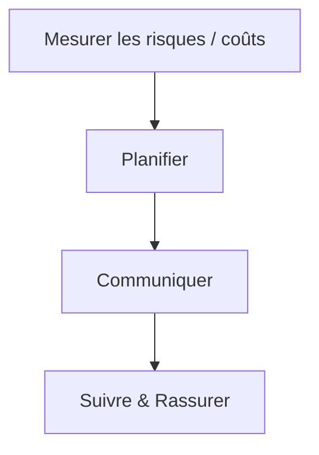
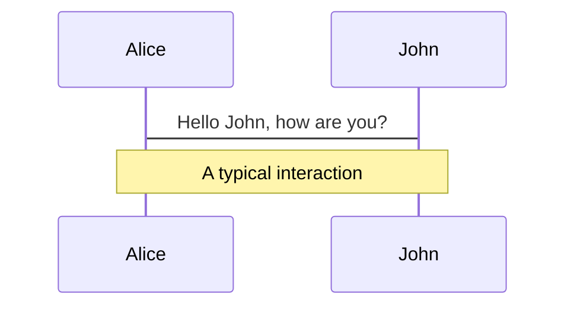
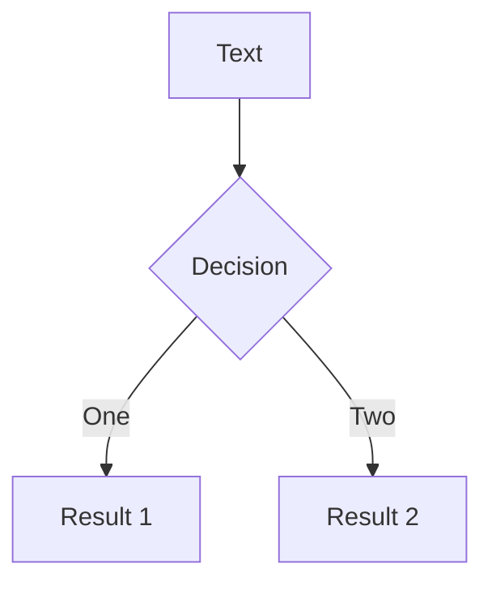
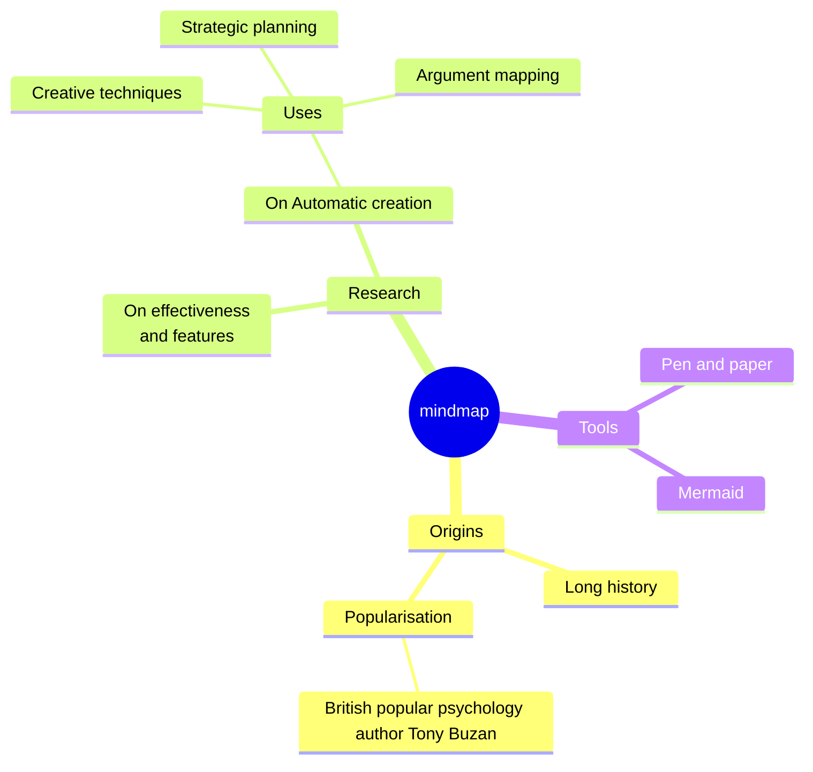
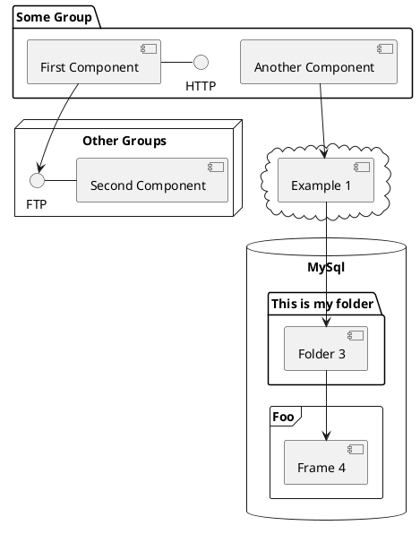

---
# You can also start simply with 'default'
theme: seriph
titleTemplate: '%s - Valentin Dumas'
fonts:
  sans: DM Sans
  serif: Noto Serif
  mono: Consolas
addons:
  - slidev-addon-graph
background: https://images.unsplash.com/photo-1716406536069-c27068316336?q=80&w=2081&auto=format&fit=crop&ixlib=rb-4.1.0&ixid=M3wxMjA3fDB8MHxwaG90by1wYWdlfHx8fGVufDB8fHx8fA%3D%3D
# some information about your slides (markdown enabled)
title: "Le dilemme du Code Legacy: on maintient ou on réécrit ?"
info: |
  ## Slidev Starter Template
  Presentation slides for developers.
class: text-center
drawings:
  persist: false
transition: fade
mdc: true
---

# Le dilemme du code legacy

## Maintenir ou Réécrire ?

<div class="abs-br m-6 text-xl">
  <span class="text-xs m-x-3 text-white/60">Valentin Dumas</span>
  <a href="https://github.com/ValentinDumas/talks" target="_blank" class="slidev-icon-btn">
    <carbon:logo-github />
  </a>
  <a href="https://www.linkedin.com/in/valentindumas" target="_blank" class="slidev-icon-btn">
    <carbon:logo-linkedin />
  </a>
</div>

<!--
The last comment block of each slide will be treated as slide notes. It will be visible and editable in Presenter Mode along with the slide. [Read more in the docs](https://sli.dev/guide/syntax.html#notes)
-->

---
transition: slide-left
layout: cover
background: /case-study-equifax/equifax.webp
---

<!--

En 2017, Equifax a subi l'une des plus grandes violations de données de l'histoire, exposant les informations personnelles d'environ 147 millions de personnes, y compris les noms, les numéros de sécurité sociale, les dates de naissance, les adresses et, dans certains cas, les numéros de permis de conduire et de carte de crédit. La violation s'est produite entre la mi-mai et juillet 2017 et n'a été découverte qu'à la fin du mois de juillet.

-->

---
transition: slide-left
layout: center
---

<!-- TODO: si le temps le permet, mettre un schéma explicatif du cas d'utilisation -->
<Card>
  
</Card>

---
transition: slide-left
layout: center
#layout: image
#image: https://images.unsplash.com/photo-1572883454114-1cf0031ede2a?q=80&w=1974&auto=format&fit=crop&ixlib=rb-4.1.0&ixid=M3wxMjA3fDB8MHxwaG90by1wYWdlfHx8fGVufDB8fHx8fA%3D%3D
---

# Causes de la faille

<div class="text-xl opacity-80 p-2">

  <!-- https://www.blackduck.com/blog/cve-2017-5638-apache-struts-vulnerability-explained.html -->
  📝 **(CVE-2017-5638)** dans **Apache Struts** : Correctif en mars 2017, non appliqué
  <br><br>

  🧑‍💻 **Corrections tardives** : Audit infructueux, certificats TLS expirés, complexité de code
<br><br>

  🤹 Pas de **segmentation réseau**:  Accès aux bases de données sur l'ensemble du réseau
<br><br>

  🛠 **Aucune limite** de requête BDD:  Extraction de données sensibles sans détection
  <!-- note: peut suggérer un manque de tests -->
  <!-- note: sur des données sensibles comme ça, on peut emettre des réserves sur les requetes de récupération -->

</div>

<style>
strong, h1 {
  color: #2B90B6;
}
</style>

<!--
Causes

https://www.blackduck.com/blog/cve-2017-5638-apache-struts-vulnerability-explained.html

Vulnérabilité logicielle non corrigée : Les attaquants ont exploité une vulnérabilité connue (CVE-2017-5638) dans Apache Struts, un cadre d'application web populaire. Un correctif pour cette vulnérabilité a été publié en mars 2017, mais Equifax ne l'a pas appliqué à ses systèmes.

Mauvaises pratiques de sécurité : Equifax a stocké les informations d'identification des administrateurs en clair et n'a pas utilisé d'authentification à deux facteurs pour les systèmes critiques, ce qui a facilité l'escalade de l'accès des attaquants une fois qu'ils étaient à l'intérieur.

Certificat de sécurité expiré : Les outils de surveillance du réseau d'Equifax n'ont pas détecté la violation pendant des mois parce qu'un certificat TLS clé avait expiré, empêchant l'inspection du trafic crypté.

Absence de segmentation du réseau : Les attaquants ont pu se déplacer latéralement au sein du réseau, accédant à d'autres bases de données après la violation initiale.

Aucune limite de requête : Aucune restriction n'a été imposée sur le nombre de requêtes de la base de données, ce qui a permis aux attaquants d'extraire d'importants volumes de données sans déclencher d'alertes.

note: peut suggérer un manque de tests
note: sur des données sensibles comme ça, on peut emettre des réserves sur les requetes de récupération

-->

---
transition: slide-left
layout: center
#layout: image
#image: https://images.unsplash.com/photo-1572883454114-1cf0031ede2a?q=80&w=1974&auto=format&fit=crop&ixlib=rb-4.1.0&ixid=M3wxMjA3fDB8MHxwaG90by1wYWdlfHx8fGVufDB8fHx8fA%3D%3D
class: text-xl opacity-80
---

# Ce qui aurait pu fonctionner ?

<div class="text-xl p-2">

  🪲 Appliquer les correctifs **dès leur publication**
  <br><br>

  🔐 Renforcer l'authentification : **authentification forte** et **multifactorielle** pour tous les accès administratifs
  <br><br>

  📊 **Monitorer** et limiter les **requêtes** BDD : requêtes excessives
  <br><br>

  💡 **Amélioration continue** sur les process et les méthodes de développement

</div>

<style>
strong, h1 {
  color: #2B90B6;
}
</style>

<!--

  Gestion des correctifs en temps opportun : Il est essentiel d'appliquer les correctifs de sécurité dès qu'ils sont publiés, en particulier pour les applications anciennes qui ne sont peut-être pas maintenues activement, mais qui traitent encore des données sensibles.

Analyse complète des vulnérabilités : Utiliser plusieurs outils d'analyse indépendants et des processus de validation pour s'assurer que tous les systèmes, y compris les anciens, sont vérifiés pour détecter les vulnérabilités connues.

Renforcer l'authentification : Exiger une authentification forte et multifactorielle pour tous les accès administratifs, et ne jamais stocker les informations d'identification en clair.

Segmentation adéquate du réseau : Limiter la capacité des attaquants à se déplacer latéralement en segmentant les réseaux et en restreignant l'accès entre les systèmes, en particulier pour les applications existantes.

Gestion des certificats et du chiffrement : Renouveler et surveiller régulièrement les certificats de sécurité afin de conserver une visibilité sur le trafic crypté et de détecter toute activité suspecte.

Limiter les requêtes dans les bases de données : Mettre en place des contrôles pour détecter et bloquer les requêtes anormales ou les extractions excessives de données, qui peuvent être le signe d'une violation en cours.

Donner la priorité à la sécurité des systèmes existants : Les applications et bases de code existantes sont souvent négligées mais peuvent constituer des points critiques de défaillance. Examinez régulièrement, mettez à jour et, si possible, remplacez ou mettez hors service les systèmes existants pour minimiser les risques.

-->

---
transition: slide-up
layout: statement
class: text-4xl opacity-80
---

❝ Legacy code is simply code **without tests** ❞

<span class="text-base text-gray-500">— Michael Feathers</span>

<!-- ... -->

<style>
strong {
  color: #2B90B6;
}
</style>

---
transition: slide-up
layout: statement
class: text-4xl opacity-80
---

❝ Legacy code is **valuable** code
<br>
<br>

you're **afraid** to change ❞

<span class="text-base text-gray-500">— Nicolas Carlo & Alex Bolboaca</span>

<!-- ... -->

<style>
strong {
  color: #2B90B6;
}
</style>

---
name: Présentation
layout: statement
class: opacity-80
---

<div class="flex flex-col justify-center items-center gap-3">
  
  <div class="pl-4 text-xl"><strong>Valentin DUMAS</strong></div>
  <div class="pl-4 text-sm">Ingénieur logiciel</div>
  
</div>

---
transition: slide-left
layout: default
---

<!-- TODO: probablement remplacer par un exemple de ton exercice de use case -->
```java [Extrait du Gilded Rose refactoring Kata] {*}{lines:true, maxHeight:'50vh'}
public void updateQuality() {
        for (int i = 0; i < items.length; i++) {
            if (!items[i].name.equals("Aged Brie")
                    && !items[i].name.equals("Backstage passes to a TAFKAL80ETC concert")) {
                if (items[i].quality > 0) {
                    if (!items[i].name.equals("Sulfuras, Hand of Ragnaros")) {
                        items[i].quality = items[i].quality - 1;
                    }
                }
            } else {
                if (items[i].quality < 50) {
                    items[i].quality = items[i].quality + 1;

                    if (items[i].name.equals("Backstage passes to a TAFKAL80ETC concert")) {
                        if (items[i].sellIn < 11) {
                            if (items[i].quality < 50) {
                                items[i].quality = items[i].quality + 1;
                            }
                        }

                        if (items[i].sellIn < 6) {
                            if (items[i].quality < 50) {
                                items[i].quality = items[i].quality + 1;
                            }
                        }
                    }
                }
            }

            if (!items[i].name.equals("Sulfuras, Hand of Ragnaros")) {
                items[i].sellIn = items[i].sellIn - 1;
            }

            if (items[i].sellIn < 0) {
                if (!items[i].name.equals("Aged Brie")) {
                    if (!items[i].name.equals("Backstage passes to a TAFKAL80ETC concert")) {
                        if (items[i].quality > 0) {
                            if (!items[i].name.equals("Sulfuras, Hand of Ragnaros")) {
                                items[i].quality = items[i].quality - 1;
                            }
                        }
                    } else {
                        items[i].quality = items[i].quality - items[i].quality;
                    }
                } else {
                    if (items[i].quality < 50) {
                        items[i].quality = items[i].quality + 1;
                    }
                }
            }
        }
    }
```

<!--
  Imagine un matin, tu arrives au bureau et quand tu ouvres ton IDE la première chose que tu vois c’est ça:

  **Montrer code** Vous arrivez à lire ce code ?.. Vous êtes forts.
  ** Expliquer code rapidement, ses défauts, ce qui peut être amélioré**
  ** montrer le code simplifié**

  Plusieurs challenges, dont un code domaine/métier qui peut s’avérer:
  complexe
  peu lisible

  On peut aussi parler de code enchevêtré, spaghetti, BBofMud, …

  **Montrer le plat de pâtes**
  Quand vous codez un soft, vous voyez le plat de pâtes.
  Vos relecteurs, et même vous-même après quelques mois sans relire le code = ce que vous voyez est magique.
  complexité visuelle → peu lisible

  A cette complexité s’ajoute ceci.
-->

---
name: Enjeux et Challenges du code legacy
transition: slide-left
layout: two-cols
---

# Un peu de legacy
Enjeux et challenges

<div class="flex flex-col gap-6 p-10 justify-center">
  <!-- Ligne 1 -->
  <div class="flex gap-8 items-center">
    
    
    
  </div>
  <!-- Ligne 2 -->
  <div v-click="4" class="flex gap-8 items-center">
    
    <span v-mark="4" class="text-xl">&gt; 100k lignes</span>
  </div>
  <!-- Ligne 3 -->
  <div v-click="5" class="flex gap-8 items-center">
    
    
  </div>
</div>

::right::

<div v-click="6" class="w-full h-full flex justify-center items-center">

</div>

---
name: Enjeux et Challenges du code legacy pt. 2
transition: slide-left
layout: two-cols
class: opacity-80
---

# Un peu de legacy
Enjeux et challenges

<div class="flex flex-col gap-6 justify-center">
  
</div>

::right::

<div class="w-full h-full flex flex-col justify-center items-center py-25">
  <!-- Ligne 1 -->
  <div class="flex gap-8 items-center">
    
    
  </div>
  <!-- Ligne 2 -->
  <div v-click class="flex gap-8 items-center">
    
  </div>
</div>

<!-- notes -->

---
name: Symptômes d'un code legacy
transition: slide-left
layout: two-cols-header
class: h-10
---

# Symptômes d’un code legacy
> Comprendre les sources des problèmes
  
  <span class="bg-red">
    TODO: mettre au propre ces notes; ET dessiner un graph (excalidraw ou slidev.) (cercle de "projet/code" avec facteurs externes/internes)
  </span>

<!-- 

- Vélocité basse (ou ne fait que baisser / + de temps pour amener des new features
- Bugs et regressions (fonctionnelles)
- Devs irremplaçables (!! si ils partent compliqué entreprise de subsister)

(
  Évolution du modèle (économique, processus, règles)

Changements réglementaires

“Mon app ne tient pas la charge”

Perte de maîtrise (connaissance, tests, ..)

Maintenance coûteuse (dette)

)

-->

::left::
<div v-click="1" class="flex flex-col justify-center h-full">
  <h3 class="text-xl font-bold mb-4">🧭 Facteurs externes</h3>
  <ul v-click="2" class="list-disc list-inside space-y-2 text-left">
    <li>Turn-over dans l’équipe</li>
    <li>Perte de connaissance métier</li>
    <li>Évolution du contexte réglementaire</li>
    <li >Pression business pour livrer vite</li>
    <li>Empilement de demandes clients</li>
  </ul>
</div>

::right::
<div v-click=3 class="flex flex-col justify-center h-full">
  <h3 class="text-xl font-bold mb-4">🔧 Facteurs internes</h3>
  <ul v-click="4"class="list-disc list-inside space-y-2 text-left">
    <li>Absence ou faible couverture de tests</li>
    <li>Couplage fort entre modules</li>
    <li>Difficulté à faire évoluer le code</li>
    <li>Manque de documentation</li>
    <li>Noms de variables ou méthodes peu explicites</li>
  </ul>
</div>

<!-- Code legacy = coûts + risques -->

---
transition: slide-left
layout: default
class: text-2xl
---

# Problèmes pour les devs

- Rechignement (olala ça touche à la partie de codebase que j’aime pas).
- Tensions, = shipper à la boure (incompréhensions entre les équipes produits et dev.
- Résignation : de tte facon tout le monde s’en fout, la codebase est pourrie, donc je continue à shipper du code pourri. et si ça me saoule un jour je m’en vais.

---
transition: slide-left
layout: default
class: text-2xl
---

# Problèmes pour les entreprises
- Perte de compétitivité
  -   Code legacy != que un pb pour les dev, c(‘est un pb  pour l’entreprise !! (ex: si les concurrents sont plus stables, …)
- Churn
- “Bus factor” le guru s(en va de l’entreprise (risque stratégique) = plus personne peut maintenir le code existant. Comment faire ???

<!-- notes.. -->

---
transition: slide-up
layout: statement
class: text-4xl
---

❝ Tout code **deviendra legacy** ❞

<style>
strong {
  color: #2B90B6;
}
</style>

<!--

“Avoir un code Legacy n'est pas un échec, ça prouve que l'application a eu du succès dans le temps, malgré la dette technique. De toute façon n'importe quel code, aussi beau soit-il écrit aujourd'hui sera le Legacy de demain. Il est quand même important de revenir régulièrement pour rafraîchir le code et enlever progressivement de la dette technique.” explique Gabriel Pillet, CTO chez Web^ID.

Effectivement, il y a 3 types de code legacy :
- Le code qui a été soigné par ses prédécesseurs. Il est clair, commenté, testé et donc facilement maintenable (mais cela n’est pas le cas le plus fréquent !).
- Le code difficilement maintenable. Il n’est pas très lisible au premier coup d’œil, il contient du code mort ou dupliqué, il y a des classes trop grandes, il y a peu, voire pas de tests unitaires, etc.
- Le code obsolète. C’est un code qui n’a pas suivi les évolutions de framework et/ou de langage. Avec les changements de versions, il est devenu difficile d’ajouter une feature et les développeurs passent leur temps à maintenir le code à flot.

-->

---
name: Remediation possibles
transition: slide-left
---

# Situations et réactions possibles

1. **Pas le temps / pas le budget**
      - la personne qui dit ça n’a pas la maitrise des riques/couts de présentés
      **Solution: présenter des risques / coûts TODO: outils :D**
2. **Refonte en sous-marin** (fausses estimations)
    = pb de confiance entre les devs et les produits == pas sain à long terme
    **Solution: confiance à recréer entre équipes TODO: activités, comment ?**
3. **Refonte sans fin**
“Il faut refondre” (sans plan) → une codebase legacy, une codebase nouvelle version (jamais prete  = jamais shippée) -> on, se retrouve à maintenir 2 codebase + mla 2eme devient Egalement un legacy -> on passe de 1 pb à 2pb <- vous etes pas assez mur la planification / sur comment on fait pour remédier sur du legacy == ça veut dire que vous avez surement besoin d’un petit coup de main sur comment on s’y prend.
  **Solution: Planification et/ou formation à prévoir**

---
name: Etude de cas banque en ligne qui veut s'etendre à linternational
transition: slide-left
---

# Etude de cas

<div class="pt-20 flex flex-col justify-center w-150">
  <Card>
  
  <span>🌎 Banque (en ligne?) française qui veut s'ouvrir à l'international</span>
  <br>

  <span>🔧 Code <!-- devenu --> complexe et fragile</span>
  <br>
  
  <span>💥 Compréhension difficile</span> <!-- Equipes ont peur de "casser" le "code" ! -->

  </Card>
</div>

<!-- Comment faire ? -->

---
transition: slide-up
layout: statement
class: text-4xl
---

❝ Legacy code is about the **cost of change** ❞

<span class="text-base text-gray-500">— Michael Feathers</span>

<!-- ... -->

<style>
strong {
  color: #2B90B6;
}
</style>

---
transition: slide-left
layout: center
---

<Card>
<!-- {theme: 'neutral', scale: 0.5} -->

</Card>

<!-- TODO: peutêtre surligner par étape pour la lisibilité !! (solution: ressortir ce diagramme à chaque étape) -->

---
transition: slide-left
layout: two-cols
class: opacity-80
---

# **Mesurer** les risques et les coûts

<!-- TODO: Lire pour la def de la dette; https://www.bitegarden.com/how-to-evaluate-technical-debt-sonarqube -->

<ul>
  <li v-click="1">Qualité de code<br><span class="opacity-50">(dette, code smells, WTF par minute)</span></li>
  <li v-click="3">Nombre de régressions fonctionnelles / nouvelle feature en prod</li>
  <li v-click="4">- Temps passé à faire des correctifs (correction de bugs, ajustements fonctionnels</li>
  <li v-click="5">- => calculer le coût réel / feature $$$$.</li>
  
</ul>

::right::

<div v-click="2" class="flex flex-col justify-center items-center w-full h-full pl-12">
  
</div>

<!-- 
Comparer “annoncé au PO” VS “temps réel pris pour shipper la feature + corriger les pb/bugs que ça a amené.”
Une fois qu’on a fait ça, on peut réfléchir à un plan

Note: y'a pas de recette magique qui fonctionne à 100% à chaque fois ! car on fait beaucoup d'humain, et l'humain est faillible: nous avons nos qualités / défaut -> et c'est ça qui rend notre métier passionnant !  
-->

---
transition: slide-left
---

# **Proposer** un plan

### Périmètre d'itervention

- Plan <- définir un périmètre d'intervention initial (=par où commencer): code de ????? (TODO: trouver un module intéressant à traiter)
- Définir un périmètre d’intervention initial ! (on ne refacto pas toute une codebase ocmme ça d’un coup., mais partie par partie, progressivement. (Exemple: On focus sur la “prise de commande)
### Actions
- Prévenir les anomalies /bugs: utiliser des Value Objects (DDD). PK ?!
- Explicitation (devises/???utiliser exemple) == migration de BDD. (ex: ce montant est un montant en euros)
- Pas de code freeze !: pas partir sur une branche à part et partir du principe que tout s’arrête à côté. Comment ? Indicateur: mesurer la proportion entre le vieux code et le nouveau code qui s’execute.

**COMPARER le coût: refonte VS statut quo**

Tout ça ? => Calculer le cop^put de la refonte (estimation gros grain à ce stade)(en nombre de jour à investir
	Comparer coût refonte VS statut quo(=si on change rien)

Une fois qu’on a ces deux coûts ? 

<!-- notes.. -->

---
transition: slide-left
---

# **Communiquer** avec les parties prenantes

Se synchroniser, communiquer avec les parties prenantes

- Informer:
  - les **personnes impactées** par notre refonte (ex: l'équipe produit des coûts et risques (en devise) actuels ??
- **Présenter** le plan de refonte (solution aux pb énumérés)
- Négocier (avec le PO?) sur **planification**. (Diplomacie: le faire en bonne intelligence)
- Obtenir l’**accord** de la direction (discuter avec les décideurs/euses de l’e,treprise (CTO, VP engineering, ) 
=> vérifier que c’est ok et **ALIGNé avec la stratégie** de l'entreprise

<!--
  parties prenantes <=> collègues
  notes...
-->

---
transition: slide-left
--- 

# **Suivre** et donner de la **visibilité**

- Eviter l'**effet tunnel** ou **dé-risquer: Comment ? PoC, baby steps (mikado), déploiements réguliers
- Vérifier que tout changement peut être **annulé** en 1min
- **Partager** l'avancement -> feedback => négociation d'amélioration de la qualité ;D / d'ajustement (car justifiées)

<!-- 
Une fois qu’on rentre dans la phase de refonte, il faut faire un suivi, et rassurer les gens avec qui on va travailler.
!! risque que ça pète est gros,
!! commencer par tacler les projets les + ambitieux en 1er 
	!! sur les tous petits périmètres… pour voir si l’approche fonctionne ou pas (PöC

éviter l’effet tunnel: …POC, baby steps + déploiements réguliers (ça spasse pas bien, on connait la cause !,

Vérifier qu’on peut annuler un changement (=rollback) < 1 min (très rapidement, TODO: vérifier le time !)
Mettre en place des indicateurs qui ne peuvent pas régresser: CI, warnings, …
Le but de tout çà ?
Partager l’avancement avec les personnes intéressées
ET négocier des ajustements si nécessaire (ex: coordination des diffferentes taches avec les equipes produits (TODO: prendre un exemple)
!! Etre transparent syr les risques (tenir au courant les personnes impactées) !! 

-->

---
name: Réécriture ou travailler avec lexistant (Brownfield)
transition: slide-left
layout: image
image: https://images.unsplash.com/photo-1748701821466-0b9f8bf839ac?q=80&w=2051&auto=format&fit=crop&ixlib=rb-4.1.0&ixid=M3wxMjA3fDB8MHxwaG90by1wYWdlfHx8fGVufDB8fHx8fA%3D%3D
class: text-xl flex flex-col justify-center
---

# Un peu de réécriture

<Card class="w-134 mt-10">

### **Brownfield** development

🐌 Reprise de l’existant
<br><br>
💸 Surprises dans le legacy
<br><br>
🔐 Stack de l’existant
<br><br>
🔥 Risques d’endettement ++ (bugs, dette, deps.)
<br><br>
🧩Challenge: Intégrer des nouvelles features
</Card>

<style>
h3 {
  color: #2B90B6;
}
</style>

<!-- notes.. -->

---
name: Réécriture from scratch (Greenfield)
transition: slide-left
layout: image
image: https://images.unsplash.com/photo-1506260408121-e353d10b87c7?q=80&w=2128&auto=format&fit=crop&ixlib=rb-4.1.0&ixid=M3wxMjA3fDB8MHxwaG90by1wYWdlfHx8fGVufDB8fHx8fA%3D%3D
class: text-xl flex flex-col justify-center
---

# Un peu de réécriture

<Card class="w-134 mt-10">

### **Greenfield** development


⏳Délai initial plus court
<br><br>
💰 Budget prévisible
<br><br>
🧱 Stack technique / architecture: choix libre
<br><br>
🟢 Peu de risques / complexité (0 dette)
<br><br>
🧩 Nécessite décisions: UI, backend, infra, tests…
</Card>

<style>
h3 {
  color: #2B90B6;
}
</style>

<!-- notes.. -->

---
transition: slide-left
layout: image
image: brownfield.png
---

# Prendre une décision

<Card>

  <div v-click>
    <h4>🚀 Réécrire</h4>
    <i class="opacity-60">
      <div>“ Le code existant est un handicap (pas de tests, pas de documentation, mauvaise structure) ”</div>
      <div>“ Vous disposez du temps, du budget et de la tolérance au risque nécessaires pour le reconstruire ”</div>
    </i>
    <br>
  </div>

  <div v-click>
    <h4>🏗️ Rearchitect</h4>
    <i class="opacity-60">
      <div>“ L'architecture de votre système limite la croissance ”</div>
      <div>“ Vous passez à des services en microservices ”</div>
    </i>
    <br>
  </div>

  <div v-click>
    <h4>🔧 Refactor</h4>
    <i class="opacity-60">
      <div>“ Vous devez nettoyer le code en toute sécurité et de manière incrémentale,</div>
      <div>sans impacter les fonctionnalités existantes ”</div>
   </i>
    <br>
  </div>
</Card>

<!-- notes.. -->

---
name: TMP conseils refacto dans codebase legacy
transition: slide-left
---

# Refactorer dans du code legacy

A retenir

<h3>Stratégie non prédictive</h3> <!-- complexité masquée (ex et tu vas le découvrir.. comment ?) -->
  <ul>
    <li>Fail-fast</li>
    <li>Méthode Mikado</li>
    <!--
      stratégie de refacto
      on part sur une strat avec un but,
      on continue jusqu'à ou on perd le controle
      quand ça pete, on revient en arrière,
      on change de direction (.. ex: on peut pas faire X -> tests approvals)
    -->
  </ul>
<h3>Besoin d'un filet de sécurité efficace</h3>
  <ul>
    <li>pas de test -> on peut rien faire..</li>
    <li>Approval tests</li>
    <li>si tests existants -> vérifier si ils ont assez pertinents pour comprendre ce qu'il passe + checker couverture
      <strong>== mutation testing</strong>
    </li>
  </ul>
<h3>Reduire la charge cognitive (on se perd, on se rappelle plus du code après N time, ...)</h3>
  <ul>
  <li>clean code</li>
  <li>typage</li>
  </ul>

<style>
h3 {
  color: #2B90B6;
  font-size: 18pt;
}
h3 div {
  padding: 8px;
}
</style>

<!-- notes -->

---
transition: slide-up
layout: statement
class: text-4xl
---

❝ On choisit de s'orienter vers un **refactoring progressif** ❞

<style>
strong {
  color: #2B90B6;
}
</style>

<!-- ... -->

---
transition: slide-left
layout: center
---


---
transition: slide-left
layout: cover
background: https://images.unsplash.com/photo-1572883454114-1cf0031ede2a?q=80&w=687&auto=format&fit=crop&ixlib=rb-4.1.0&ixid=M3wxMjA3fDB8MHxwaG90by1wYWdlfHx8fGVufDB8fHx8fA%3D%3D
---

## Conclusion

<style>
h2 {
  font-size: 28pt;
  opacity: 0.8
}
</style>

---
transition: slide-up
level: 2
---

# Navigation

Hover on the bottom-left corner to see the navigation's controls panel, [learn more](https://sli.dev/guide/ui#navigation-bar)

## Keyboard Shortcuts

|                                                     |                             |
| --------------------------------------------------- | --------------------------- |
| <kbd>right</kbd> / <kbd>space</kbd>                 | next animation or slide     |
| <kbd>left</kbd>  / <kbd>shift</kbd><kbd>space</kbd> | previous animation or slide |
| <kbd>up</kbd>                                       | previous slide              |
| <kbd>down</kbd>                                     | next slide                  |

<!-- https://sli.dev/guide/animations.html#click-animation -->

<p v-after class="absolute bottom-23 left-45 opacity-30 transform -rotate-10">Here!</p>

---
layout: two-cols
layoutClass: gap-16
---

# Table of contents

You can use the `Toc` component to generate a table of contents for your slides:

```html
<Toc minDepth="1" maxDepth="1" />
```

The title will be inferred from your slide content, or you can override it with `title` and `level` in your frontmatter.

::right::

<Toc text-sm minDepth="1" maxDepth="2" />

---
layout: image-right
image: https://cover.sli.dev
---

# Code

Use code snippets and get the highlighting directly, and even types hover!

```ts [filename-example.ts] {all|4|6|6-7|9|all} twoslash
// TwoSlash enables TypeScript hover information
// and errors in markdown code blocks
// More at https://shiki.style/packages/twoslash
import { computed, ref } from 'vue'

const count = ref(0)
const doubled = computed(() => count.value * 2)

doubled.value = 2
```

<arrow v-click="[4, 5]" x1="350" y1="310" x2="195" y2="342" color="#953" width="2" arrowSize="1" />

<!-- This allow you to embed external code blocks -->
<<< @/snippets/external.ts#snippet

<!-- Footer -->

[Learn more](https://sli.dev/features/line-highlighting)

<!-- Inline style -->
<style>
.footnotes-sep {
  @apply mt-5 opacity-10;
}
.footnotes {
  @apply text-sm opacity-75;
}
.footnote-backref {
  display: none;
}
</style>

<!--
Notes can also sync with clicks

[click] This will be highlighted after the first click

[click] Highlighted with `count = ref(0)`

[click:3] Last click (skip two clicks)
-->

---
level: 2
---

# Shiki Magic Move

Powered by [shiki-magic-move](https://shiki-magic-move.netlify.app/), Slidev supports animations across multiple code snippets.

Add multiple code blocks and wrap them with <code>````md magic-move</code> (four backticks) to enable the magic move. For example:

````md magic-move {lines: true}
```ts {*|2|*}
// step 1
const author = reactive({
  name: 'John Doe',
  books: [
    'Vue 2 - Advanced Guide',
    'Vue 3 - Basic Guide',
    'Vue 4 - The Mystery'
  ]
})
```

```ts {*|1-2|3-4|3-4,8}
// step 2
export default {
  data() {
    return {
      author: {
        name: 'John Doe',
        books: [
          'Vue 2 - Advanced Guide',
          'Vue 3 - Basic Guide',
          'Vue 4 - The Mystery'
        ]
      }
    }
  }
}
```

```ts
// step 3
export default {
  data: () => ({
    author: {
      name: 'John Doe',
      books: [
        'Vue 2 - Advanced Guide',
        'Vue 3 - Basic Guide',
        'Vue 4 - The Mystery'
      ]
    }
  })
}
```

Non-code blocks are ignored.

```vue
<!-- step 4 -->
<script setup>
const author = {
  name: 'John Doe',
  books: [
    'Vue 2 - Advanced Guide',
    'Vue 3 - Basic Guide',
    'Vue 4 - The Mystery'
  ]
}
</script>
```
````

---

# Components

<div grid="~ cols-2 gap-4">
<div>

You can use Vue components directly inside your slides.

We have provided a few built-in components like `<Tweet/>` and `<Youtube/>` that you can use directly. And adding your custom components is also super easy.

```html
<Counter :count="10" />
```

<!-- ./components/Counter.vue -->
<Counter :count="10" m="t-4" />

Check out [the guides](https://sli.dev/builtin/components.html) for more.

</div>
<div>

```html
<Tweet id="1390115482657726468" />
```

<Tweet id="1390115482657726468" scale="0.65" />

</div>
</div>

<!--
Presenter note with **bold**, *italic*, and ~~striked~~ text.

Also, HTML elements are valid:
<div class="flex w-full">
  <span style="flex-grow: 1;">Left content</span>
  <span>Right content</span>
</div>
-->

---

# Clicks Animations

You can add `v-click` to elements to add a click animation.

<div v-click>

This shows up when you click the slide:

```html
<div v-click>This shows up when you click the slide.</div>
```

</div>

<br>

<v-click>

The <span v-mark.red="3"><code>v-mark</code> directive</span>
also allows you to add
<span v-mark.circle.orange="4">inline marks</span>
, powered by [Rough Notation](https://roughnotation.com/):

```html
<span v-mark.underline.orange>inline markers</span>
```

</v-click>

<div mt-20 v-click>

[Learn more](https://sli.dev/guide/animations#click-animation)

</div>

---

# Diagrams

You can create diagrams / graphs from textual descriptions, directly in your Markdown.

<div class="grid grid-cols-4 gap-5 pt-4 -mb-6">









</div>

Learn more: [Mermaid Diagrams](https://sli.dev/features/mermaid) and [PlantUML Diagrams](https://sli.dev/features/plantuml)

---
src: ./pages/imported-slides.md
hide: false
---

---

# Monaco Editor

Slidev provides built-in Monaco Editor support.

Add `{monaco}` to the code block to turn it into an editor:

```ts {monaco}
import { ref } from 'vue'
import { emptyArray } from './external'

const arr = ref(emptyArray(10))
```

Use `{monaco-run}` to create an editor that can execute the code directly in the slide:

```ts {monaco-run}
import { version } from 'vue'
import { emptyArray, sayHello } from './external'

sayHello()
console.log(`vue ${version}`)
console.log(emptyArray<number>(10).reduce(fib => [...fib, fib.at(-1)! + fib.at(-2)!], [1, 1]))
```

---
layout: center
class: text-center
---

# Learn More

[Documentation](https://sli.dev) · [GitHub](https://github.com/slidevjs/slidev) · [Showcases](https://sli.dev/resources/showcases)

<PoweredBySlidev mt-10 />
